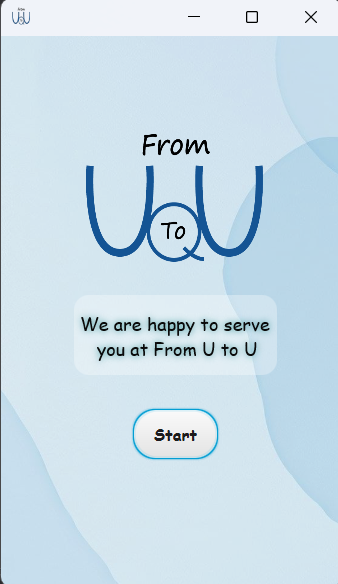
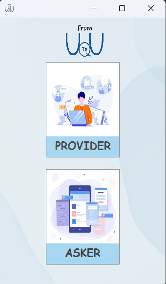
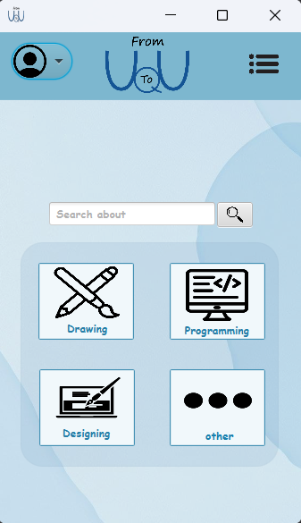

# 📱 FromUtoU

**From You To You** is a dual-role service-sharing application where users can either **offer services (Provider)** or **request services (Asker)** — all within a beautifully organized Java-based desktop interface.

---

## 💡 What Does It Do?

This application connects individuals with services to offer, and individuals looking for help. It allows users to:

- Choose their role: **Provider** or **Asker**
- Switch roles at any time
- Browse available services by category
- Add new services through a step-by-step form
- View and manage services in a personal dashboard

---

## ✨ Key Features

### 🔹 For All Users
- Select user role (Provider / Asker)
- Intuitive UI and icon-based guidance
- Browse categorized services (Design, Programming, Drawing, and more)

### 💼 As a Provider
- Add services with:
  - Title, category, price, and description
  - Contact info (WhatsApp, Email, Instagram, Twitter)
  - Media files (images or video)
  - Payment method selection (Free, Mada, Visa, Cash)
- View all personal services in a dashboard

### 🔍 As an Asker
- Browse services grouped by category
- Explore service details and contact providers
- No login required to view services (optional in future version)
- Ability to search and filter services


---

## 📸 Screenshots

### Welcome Screen

This is the first screen users see when they launch the app. It shows the app's branding and a welcome message to start the experience:



---

### User Role Selection
After logging in, users choose whether they want to offer services (Provider) or request services (Asker), guiding them to tailored experiences:



---

### Service Categories
Providers can classify their services under different categories like Drawing, Programming, Designing, or Others. Users can also search for specific services using the search bar.:



---

### Provider Services
This is the provider's main page, showcasing all the services they’ve added:


---

## 🛠️ Tech Stack

- **Language:** Java  
- **UI:** JavaFX + FXML  
- **Structure:** Role-based dynamic interface  
- **Data:** Local handling (no backend integration yet)

---

## 🗂️ Project Structure

```bash
FromUtoU/
├── FromUtoU.iml
├── README.md
├── out/                      # Compiled output (if any)
├── screenshots/              # UI images for documentation
├── src/                      # Source files
│   └── com/
│       └── example/
│           └── fromuto/      # All Java source and FXML files
│               ├── AddServices1.fxml
│               ├── AddServices2.fxml
│               ├── AddServices3.fxml
│               ├── Design.fxml
│               ├── Drawing.fxml
│               ├── Programming.fxml
│               ├── ServiceDetails.fxml
│               └── ...etc


🚀 Future Plans
🔒 User authentication

🧠 Smart filtering and recommendations

⭐ Ratings & feedback from Askers

📥 Service request & direct chat system

🌐 Hosting on web or mobile via Flutter (possible extension)

👩‍💻 Developer
Made with 💜 by Maram-Metro
Explore my Portfolio

