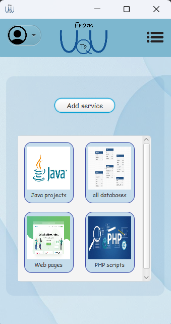
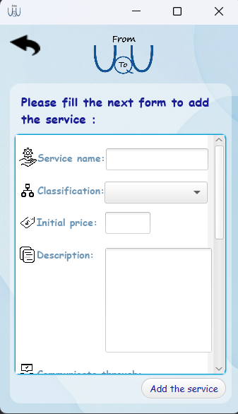
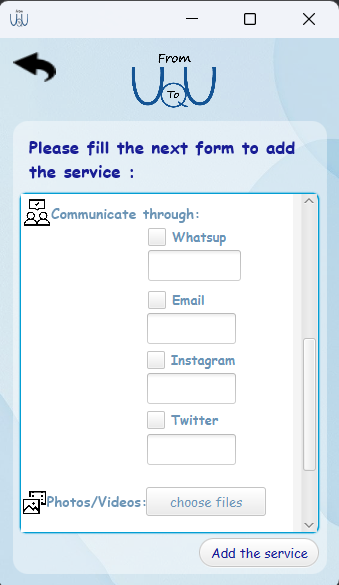
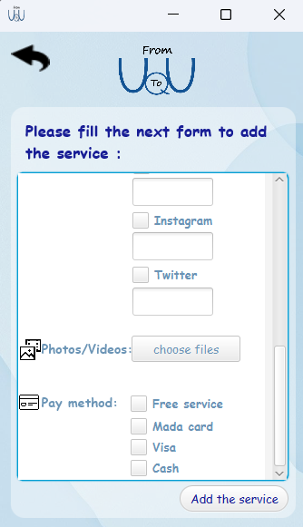

# 📱 FromUtoU

**From You To You** is a mini service-sharing application that connects two types of users:

- 💼 **Providers** – who offer services.
- 🔍 **Askers** – who browse and benefit from services.

This simple app builds a smooth bridge between those who want to **offer** and those who want to **ask**.

---

## ✨ Features

### 👤 For Providers
Providers can:
- Add new services by filling a 3-step form that includes:
  - 📝 **Basic Info**: Name, classification, price, description.
  - 📞 **Contact Info**: WhatsApp, Email, Instagram, Twitter.
  - 🖼️ **Media & Payment**: Upload photos/videos, select payment methods (Free, Mada card, Visa, Cash).
- View all previously added services in a personal dashboard.
- Organize their offerings by category.

### 🔎 For Askers
Askers can:
- Browse available services through categories such as:
  - Java Projects
  - Web Pages
  - PHP Scripts
  - Databases
- View details of each service including:
  - Description
  - Contact options
  - Media
  - Payment method
- Contact the provider directly using the provided links.

---

## 📸 Screenshots

### Provider Dashboard
Shows all services added by the provider:



---

### Add Service – Step 1
Enter service name, classification, price, and description:



---

### Add Service – Step 2
Provide communication details and upload media:



---

### Add Service – Step 3
Choose payment methods and finalize submission:



---

## 🛠️ Tech Stack

- **Language**: Java  
- **UI Framework**: JavaFX  
- **Design Style**: Clean, scrollable multi-step form  
- **Data Handling**: Locally managed (placeholder for database integration)

---

## 🚀 Future Enhancements

- Implement user authentication (for Askers and Providers)
- Add a search & filter system for services
- Allow Askers to rate or favorite services
- Enable Providers to edit or delete services
- Support for notifications when a service gets interest

---

## 📂 Project Structure

```bash
FromYouToYou/
├── src/
│   ├── Main.java
│   ├── views/
│   │   ├── ProviderDashboard.java
│   │   ├── AddServiceStep1.java
│   │   ├── AddServiceStep2.java
│   │   └── AddServiceStep3.java
│   └── models/
│       └── Service.java
├── assets/
│   └── images/
├── README.md
